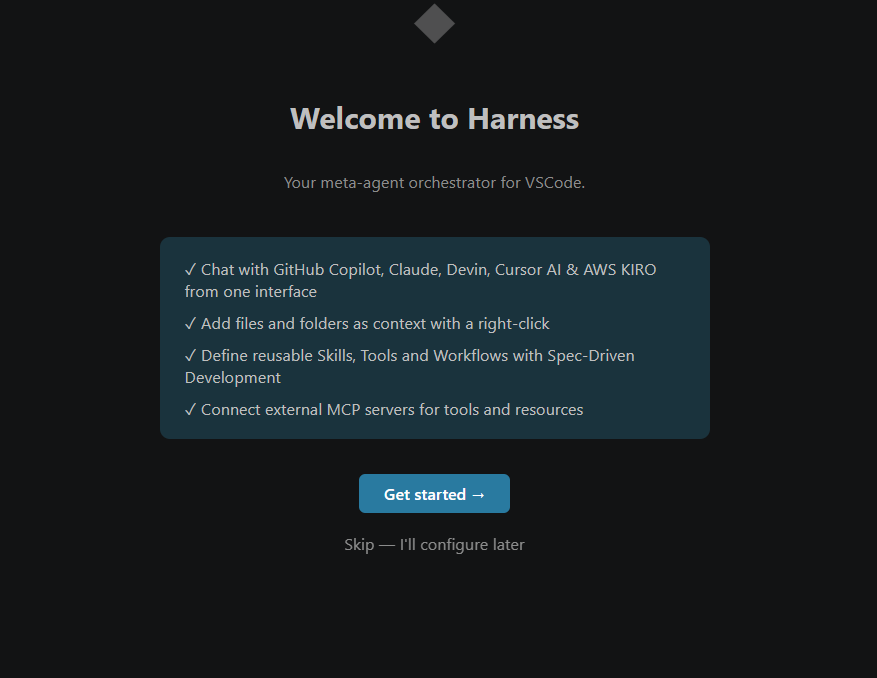
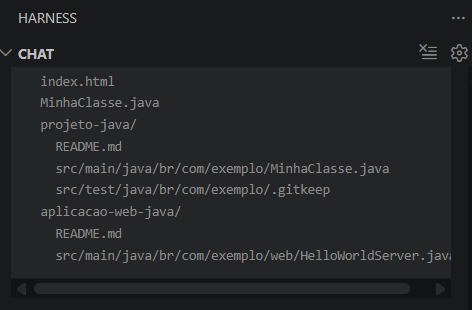

# User manual — Harness of AI

> Portuguese version for the GitHub Wiki: [User-Manual](https://github.com/nbsjunior/harness/wiki/User-Manual)

**Harness of AI** is a meta-agent orchestrator for VS Code: one sidebar for **Copilot**, **Claude**, **Cursor**, **Devin**, and **Kiro**, with shared file context and Spec-Driven Development (SDD).

---

## 1. Install

1. Download `harness-vscode-0.1.0.vsix` from [Releases](https://github.com/nbsjunior/harness/releases).
2. VS Code / Cursor: `Ctrl+Shift+P` → **Extensions: Install from VSIX...**
3. **Developer: Reload Window**
4. Click the **Harness of AI** icon in the Activity Bar.

---

## 2. Welcome screen

On first configuration open, the setup wizard introduces core features:

Click **Get started →** to configure agents, or **Skip** to configure later.

---

## 3. Chat and context

- Right-click files → **Add to Harness of AI Context**
- Chips above the composer show attached files
- **+ New chat** — new conversation, keeps context
- **Clear context** — removes file chips only
- View title action — **Clear Chat & Context**

Provider pills at the bottom: **Auto**, **Copilot**, **Claude**, **Cursor**, **Devin**, **Kiro**.

Copilot modes: **Ask** | **Agent** | **Spec+Agent**

---

## 4. Configuration — Agents

`Ctrl+Shift+P` → **Harness of AI: Open Configuration**

Use **Configure** on each agent and **Test Connection** after entering API keys.

---

## 5. Configuration — API Servers

Built-in endpoints for Copilot, Devin, and Cursor. Add custom OpenAI-compatible servers with **+ Add API server**.

---

## 6. Other tabs

| Tab | Purpose |
|-----|---------|
| **MCP** | External MCP servers |
| **Workspace** | Default workspace path, default agent, prompt optimization |
| **Spending** | Token/request usage per provider |

---

## 7. Commands

All commands are under category **Harness of AI** in the Command Palette:

- **Initialize Workspace** — creates `.harness/`
- **Open Configuration**
- **Clear Chat & Context**
- **Check getGoat** — agent diagnostics

See also [starter-kit.md](starter-kit.md) and [user-guide.md](user-guide.md).
