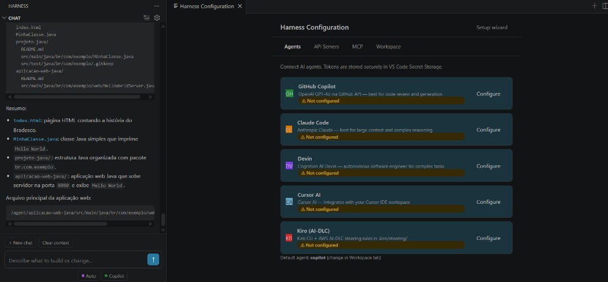
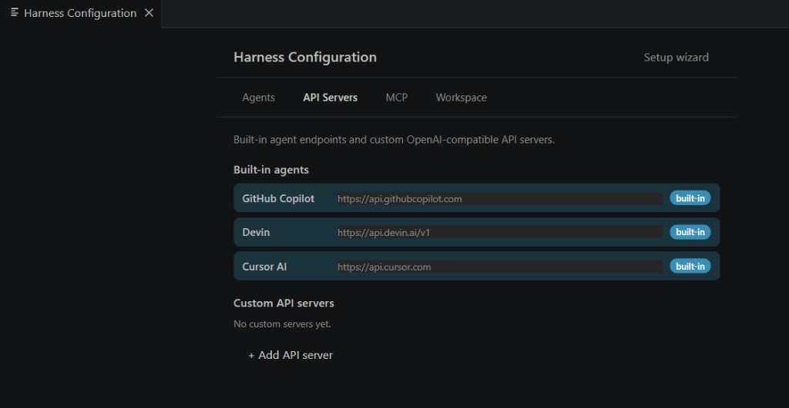

  

# User Manual — Harness of AI

**Harness of AI** is a meta-agent orchestrator for VS Code: one sidebar for **Copilot**, **Claude**, **Cursor**, **Devin**, and **Kiro**, with shared file context and Spec-Driven Development (SDD).

> **In the app:** `Ctrl+Shift+P` → **Harness of AI: Open User Manual** (dedicated editor tab with screenshots).

---

## 1. Install

1. Download `harness-vscode-*.vsix` from [Releases](https://github.com/nbsjunior/harness/releases).
2. `Ctrl+Shift+P` → **Extensions: Install from VSIX...**
3. **Developer: Reload Window**
4. Click the **Harness of AI** icon (fox) in the Activity Bar.

---

## 2. Welcome & setup wizard

On first configuration, the welcome screen summarizes what you get in **one place**:

| Feature | Description |
|---------|-------------|
| Unified chat | Copilot, Claude, Devin, Cursor, and Kiro in the same panel |
| Shared context | Right-click → **Add to Harness of AI Context** |
| Specs (SDD) | Skills, Tools, and Workflows in `.harness/specs/` |
| MCP | External tool servers |

Click **Get started →** to configure agents, or **Skip** and configure later. The wizard ends with this **User Manual** step before you finish setup.

---

## 3. Chat & shared context

Everything happens in one interaction surface — no copy-paste between tools:

- **Explorer** or editor → right-click → **Add to Harness of AI Context**
- File chips appear above the composer; the **same context** is sent to whichever provider you pick next
- **+ New chat** — new thread, keeps context
- **Clear context** — removes file chips only
- View title → **Clear Chat & Context** — full reset

**Providers:** Auto, Copilot, Claude, Cursor, Devin, Kiro.  
**Copilot modes:** Ask | Agent | Spec+Agent.

---

## 4. Configure agents

Use **Configure** on each agent and **Test Connection** after saving keys. Tokens are stored in VS Code Secret Storage.

---

## 5. API servers

Built-in endpoints for Copilot, Devin, and Cursor. Add custom OpenAI-compatible servers with **+ Add API server**.

---

## 6. Commands

| Command | Purpose |
|---------|---------|
| `Harness of AI: Open User Manual` | This guide (dedicated tab) |
| `Harness of AI: Open Configuration` | Agents, MCP, workspace, spending |
| `Harness of AI: Initialize Workspace` | Create `.harness/` |
| `Harness of AI: Check getGoat` | Agent diagnostics |

---

## 7. Help

- [Troubleshooting](Troubleshooting)
- [Auto Routing](Auto-Routing)
- [Getting Started](Getting-Started)

Repository: [github.com/nbsjunior/harness](https://github.com/nbsjunior/harness)
